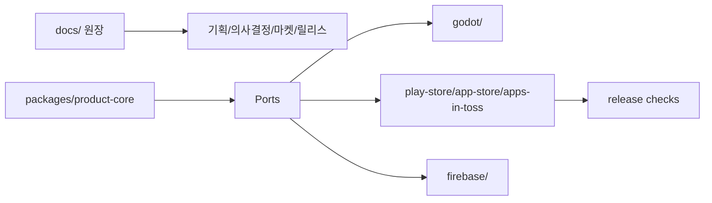

# Foam Party Agent Instructions

## 기본 원칙

- 한글을 주 사용언어로 한다.
- 항상 간결하고 실무적으로 답변한다.
- 애매한 부분은 상상해서 채우지 말고, 파일, 로그, 설정, 실행 결과를 먼저 확인한다.
- 사용자의 말이 사실과 다르거나 기술적으로 부정확하면 바로잡는다.
- 복잡한 구조 설명은 가능하면 Mermaid로 도식화한다.
- 대화 중 장기 지식으로 남길 만한 확인 사실은 문서화한다. 이 repo의 제품 실행 원장은 `docs/`이고 Obsidian은 보조 지식베이스다.

## Source Of Truth

- 기획, 의사결정, 작업 로그, 마켓 정보, 릴리스 준비 상태의 원장은 `docs/`다.
- 콘솔에서만 바뀐 값은 release-ready로 보지 않는다. Google Play, App Store, AppsInToss, Firebase 관련 값은 repo-local config 또는 `docs/05-markets/`에 남긴다.
- 새로 확정해야 하는 값은 `확정 필요`로 남기고 임의로 채우지 않는다.
- 현재 App Store 실행 원본은 `app-store/app-store.config.json`, `docs/app-store-registration.md`, `docs/app-store-release.md`다.

## Local Overrides

- `AGENTS.local.md` 또는 `AGENT.local.md`가 있으면 먼저 읽고 개별 프로젝트 지침으로 적용한다.
- local agent 파일은 개인 환경, signing path, bundle id, console app id, runner 예외 등 프로젝트별/개인별 설정만 담는다.
- local agent 파일은 커밋하지 않는다. 예시는 `AGENTS.local.example.md`를 사용한다.

## 구조 원칙

- 현재 MVP는 Godot 4.6.3 기반 local-only 게임이다. Firebase, 광고, IAP, 계정 기능은 아직 없다.
- `packages/product-core`에는 엔진 독립 규칙, 유스케이스, 포트, 순수 테스트만 둔다.
- `packages/product-core`는 Godot, Firebase, AppsInToss, Google Play, App Store, 광고 SDK, 결제 SDK, 네트워크 클라이언트를 직접 import하지 않는다.
- Godot scene tree, rendering, input, animation, physics, lifecycle은 `godot/`에 둔다.
- 시장별 delivery/adapters는 `play-store/`, `app-store/`, `apps-in-toss/`, `apps/ait/`, `firebase/`로 분리한다.

## GitHub Actions / ARC

- Seorilabs GitHub Actions 또는 ARC runner 라우팅을 작성/수정/진단할 때는 `seorilabs-arc-runners` 스킬을 사용한다.
- runner 이름, Node/Godot 버전, action 버전의 shared source of truth는 org 운영 저장소의 `global-versions.yaml`이다. 위치와 최신값은 `seorilabs-arc-runners` 스킬로 확인한다.
- GitHub Actions action/module 버전은 GitHub 공식 repo/API 또는 공식 문서 기준 최신 stable major를 확인한다. `@latest`나 branch 참조보다 확인된 major tag를 선호한다.
- 현재 확인 기준: `actions/checkout@v6`, `actions/setup-node@v6`, `actions/upload-artifact@v7`.
- Godot compile, Godot Web build, docs/core/architecture checks는 repo가 private이면 `seorilabs-rpi-arm64`, public이면 `ubuntu-latest`로 간다. workflow의 `github.event.repository.private` 가드가 이 분기를 담당한다.
- public 경로에는 Seorilabs private ARC runner를 노출하지 않는다. 러너를 고정하는 재사용 워크플로우를 호출할 때도 `runs_on` 가드를 함께 넘긴다.
- ARM64/RPI Docker build는 `seorilabs-rpi-arm64-dind`를 사용한다.
- Android AAB/APK release build는 RPI ARC로 보내지 않는다. Android SDK Build Tools Linux `aapt2`가 x86-64 binary라 x64 Linux가 필요하고, 중앙 워크플로우는 `ubuntu-latest`를 쓴다.
- Apple App Store/Xcode build는 macOS runner가 필요하므로 RPI ARC로 보내지 않는다.

## 테스트 레이어

- `npm run test:core`: product core 구조/순수 테스트 scaffold 확인.
- `npm run check:architecture`: core import boundary 확인.
- `npm run test:godot`: Godot import, compile, smoke scene 확인. Godot headless exit code만 믿지 말고 로그의 `SCRIPT ERROR` / `ERROR:`도 실패로 처리한다.
- `npm run check:docs`: docs 원장 구조 확인.
- `npm run check:release`: Google Play, App Store, AppsInToss, Firebase, privacy, signing, asset blocker inventory.
- `npm run check:app-store`: App Store 로컬 빌드/서명/screenshot blocker 확인.

## 배포 게이트

- Deployment approval 전에는 store submission, production track promotion, AppsInToss production release를 하지 않는다.
- `.ait` 생성 성공은 AppsInToss 콘솔 등록, 이미지, 광고, sandbox QA 완료를 의미하지 않는다.
- release candidate는 `test:core`, `check:architecture`, `test:godot`, 시장별 release inventory를 통과해야 한다.

## Autonomous Issue Routine (Autopilot)

- 클라우드 autopilot 루틴이 열린 이슈를 순차 처리한다. 실행 절차는 `docs/08-ops/autopilot.md`(foam-party 전용)와 org 공통 계약 `seorilabs/.github`의 `docs/agent-governance/autonomous-issue-routine.md`를 따른다.
- 루틴 프롬프트에 절차를 복붙하지 않는다. 위 두 문서를 source of truth로 유지·갱신한다.

## Git / PR

- GitHub PR 제목과 Description은 한글로 작성한다. 고유명사, 명령어, 코드, 에러 메시지는 원문 유지 가능하다.
- PR Description에 구조나 흐름 이해가 필요하면 Mermaid 다이어그램을 포함한다.
- Copilot Review는 보정 커밋 이후 명시적으로 re-request해야 한다.
- 사용자 변경은 되돌리지 않는다. 관련 없는 dirty worktree는 무시하고, 충돌하는 경우 먼저 확인한다.
