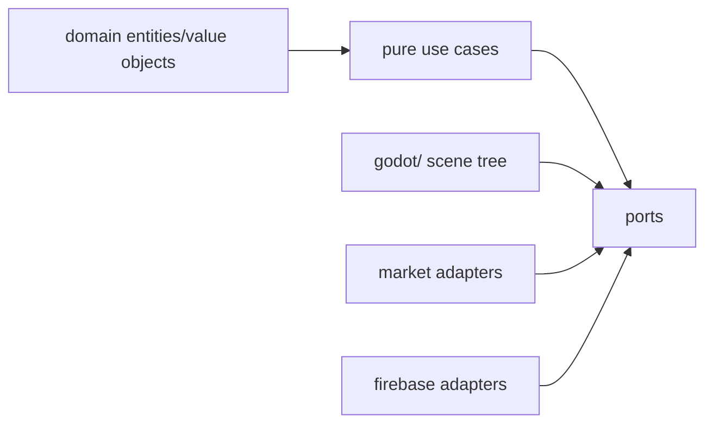

# Clean Architecture Boundary

## 현재 상태

현재 gameplay는 Godot MVP 속도를 위해 `godot/scripts/main.gd`에 집중되어 있다. 이번 구조 정리는 즉시 대규모 refactor를 하지 않고, 향후 엔진 독립 규칙을 옮길 위치와 검증 경계를 먼저 만든다.

## Dependency Rule

의존 방향은 바깥 계층에서 안쪽 계층으로만 향한다. core는 platform/runtime SDK를 모른다.

## packages/product-core

허용:

- Domain entities
- Value objects
- Pure use cases
- Port interfaces
- Pure fixtures/fakes

금지:

- Godot scene tree, `Node`, `Control`, `SceneTree`, `Resource` 의존
- Firebase SDK, Admin SDK, service account
- AppsInToss SDK
- Google Play Billing, App Store StoreKit
- Ad SDK
- Network/client SDK 직접 호출

## godot

허용:

- Scenes
- Rendering/input/animation/physics
- Game lifecycle
- Port adapter wiring

`godot/scripts/main.gd`에서 engine-independent rule을 추출할 때는 먼저 `packages/product-core/src/domain` 또는 `packages/product-core/src/use_cases`에 순수 테스트 가능한 형태로 옮긴다.

## Market Adapters

시장별 release, metadata, config, wrapper는 다음 위치에 둔다.

- Google Play: `play-store/`
- App Store: `app-store/`
- AppsInToss: `apps-in-toss/`, `apps/ait/`
- Firebase: `firebase/`
